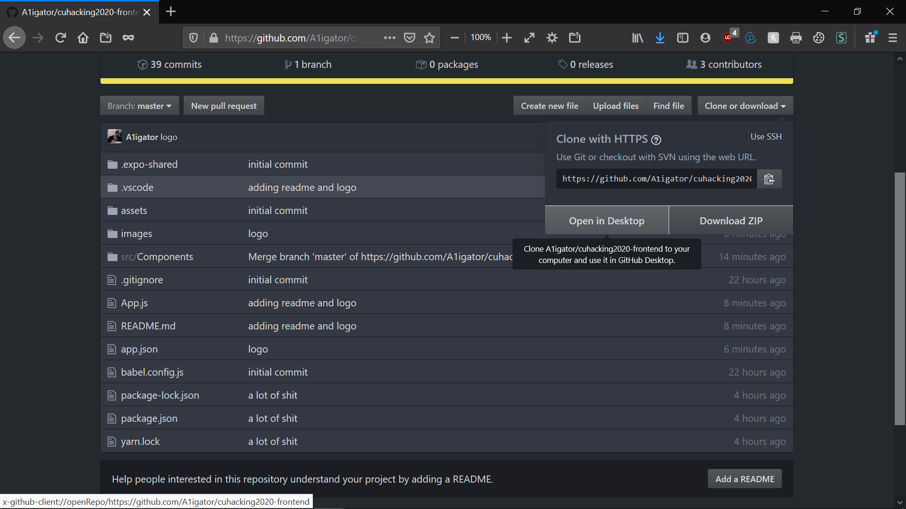

#Cuhacking2020
 
Welcome to StudentsHelpingStudents
 

 
This year we made a app to help students learn. The goal of the app is to let student who stuggle in different subjects learn more as well as get them to teach other students. It's a social media!
 

 
 
To use the app you will have to get expo on your phone off the google play store or app store.
 
 

 
Then go to the repo and clone it.
 

 
 
Then you will need to open terminal and type "expo start".
 

 
 
You will be moved to a new page and you must scan the QR code with the expo app.
 
 

 
That is how to get onto StudentsHelpingStudents so go try it out for free!
